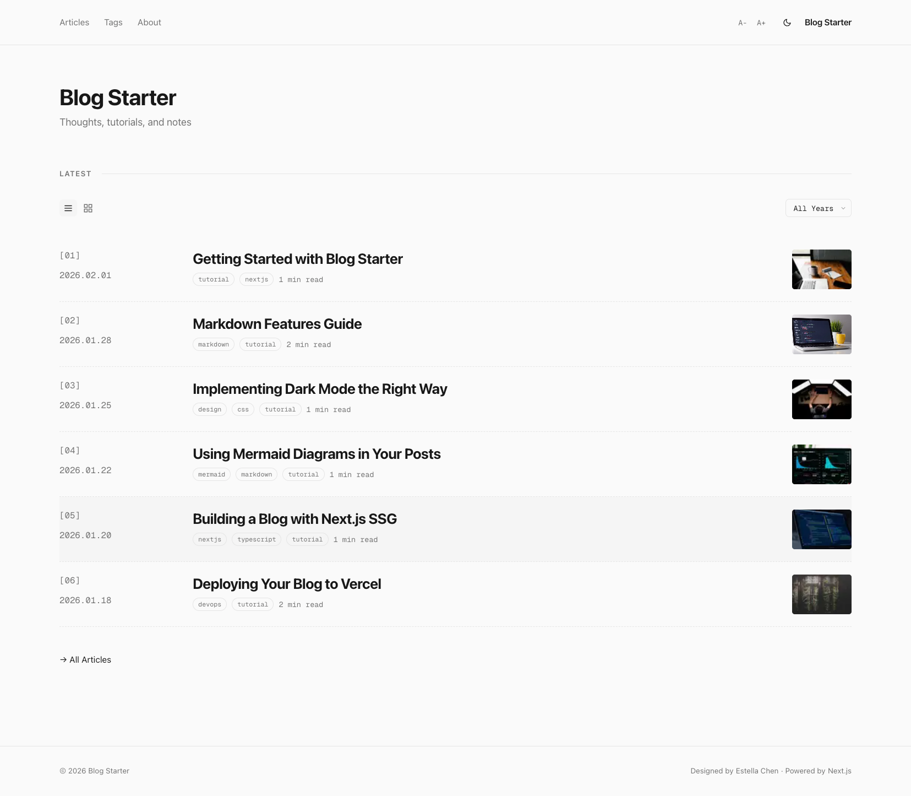
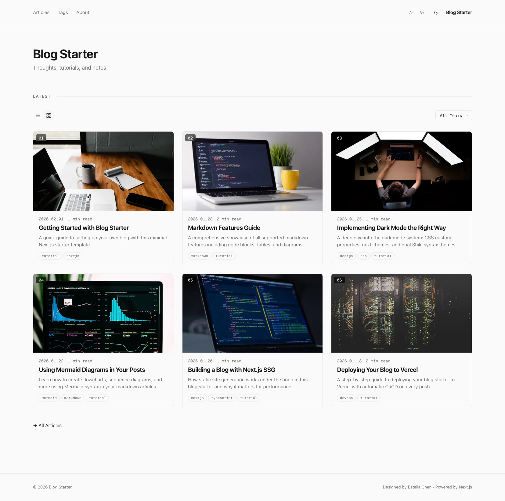
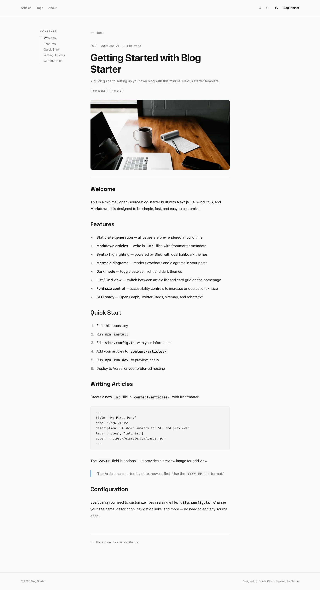
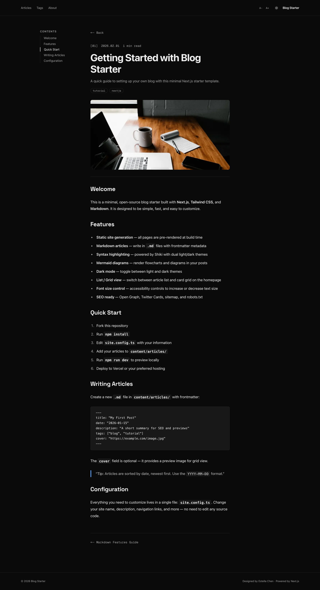
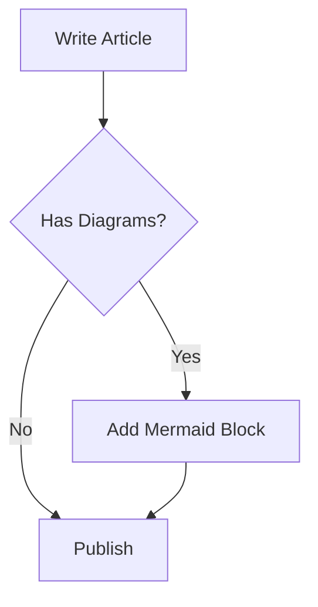

# Blog Starter

A minimal, open-source blog template built with Next.js, Tailwind CSS, and Markdown. Fork it, configure it, deploy it — your blog is live.

## Preview

| List View | Grid View |
|-----------|-----------|
|  |  |

| Article Page | Dark Mode |
|-------------|-----------|
|  |  |

## Features

- **Static site generation** — all pages pre-rendered at build time
- **Markdown articles** — write in `.md` files with frontmatter
- **List / Grid view** — toggle between article list and card grid
- **Date range filter** — filter articles by date
- **Cover images** — per-article cover with show/hide control
- **Dark mode** — light / dark / system toggle via next-themes
- **Font size control** — A- / A+ accessibility buttons
- **Syntax highlighting** — Shiki with dual light/dark themes
- **Mermaid diagrams** — flowcharts and diagrams in posts (CDN loaded)
- **Table of contents** — auto-generated sidebar from headings
- **SEO** — Open Graph, Twitter Cards, sitemap.xml, robots.txt
- **AI bot blocking** — configurable robots.txt to block AI crawlers
- **Zero database** — just Markdown files, no CMS needed

---

## 1. Get the Source

**Option A — Fork on GitHub:**

```bash
# Fork this repo, then clone your fork:
git clone https://github.com/YOUR_USERNAME/blog-starter.git
cd blog-starter
```

**Option B — Download directly:**

```bash
# Download and extract (no GitHub account needed):
npx degit e5tella/blog-starter my-blog
cd my-blog
git init
```

## 2. Install Dependencies

```bash
npm install
```

## 3. Configure Your Blog

Open **`site.config.ts`** — this is the only file you need to edit:

```typescript
const siteConfig = {
  // -- Core identity --
  name: "My Blog",                          // site title
  description: "A minimal blog",            // meta description
  url: "https://yourdomain.com",            // production URL (used for sitemap & OG tags)

  // -- Author --
  author: {
    name: "Your Name",
    email: "you@example.com",
    github: "https://github.com/you",
    twitter: "https://twitter.com/you",     // leave empty to hide
  },

  // -- Navigation links --
  nav: [
    { label: "Articles", href: "/articles" },
    { label: "Tags", href: "/tags" },
    { label: "About", href: "/about" },
  ],

  // -- Homepage --
  homepage: {
    title: "My Blog",
    subtitle: "Thoughts, tutorials, and notes",
    articlesPerPage: 5,                     // number of articles on the homepage
  },

  // -- Article defaults --
  articles: {
    defaultCover: "/images/placeholder-cover.jpg",  // fallback cover for grid view
  },

  // -- Footer --
  footer: {
    copyright: "My Blog",
    showPoweredBy: true,                    // show "Powered by Next.js" in footer
  },

  // -- SEO --
  locale: "en_US",
  robots: {
    blockAiBots: true,                      // block AI crawlers (GPTBot, CCBot, etc.)
  },

  // -- Theme --
  theme: {
    defaultMode: "system",                  // "light" | "dark" | "system"
  },

  // -- Font size accessibility --
  fontSize: {
    min: 14,                                // minimum font size (px)
    default: 16,
    max: 20,                                // maximum font size (px)
    step: 2,                                // increment per click
  },
};
```

## 4. Write Articles

Create a `.md` file in `content/articles/`:

```yaml
---
title: "My First Post"
date: "2026-01-15"
description: "A short summary for the article list and SEO"
tags: ["blog", "tutorial"]
cover: "https://images.unsplash.com/photo-xxxxx?w=800&h=450&fit=crop"
showCover: true
---

Your markdown content here...
```

### Frontmatter Fields

| Field | Required | Default | Description |
|-------|----------|---------|-------------|
| `title` | Yes | — | Article title |
| `date` | Yes | — | Publication date (`YYYY-MM-DD`) |
| `description` | No | `""` | Summary shown in article list and meta tags |
| `tags` | No | `[]` | Array of tag strings |
| `cover` | No | `defaultCover` | Cover image URL (shown in grid view and article page) |
| `showCover` | No | `true` | Set to `false` to hide cover image on the article page |

### Supported Markdown

- Headings, bold, italic, strikethrough
- Code blocks with syntax highlighting (Shiki)
- Tables, blockquotes, ordered/unordered lists
- Mermaid diagrams — use ` ```mermaid ` code blocks
- Images, links, horizontal rules

### Mermaid Example

````markdown

````

Diagrams render client-side via CDN and automatically adapt to dark mode.

## 5. Edit the About Page

Edit `content/about.md` with your own content. Standard markdown is supported.

## 6. Replace Icons

Replace these files with your own:

- `app/icon.png` — favicon (recommended: 512x512 PNG)
- `app/apple-icon.png` — Apple touch icon (recommended: 180x180 PNG)

## 7. Run Locally

```bash
npm run dev
```

Open [http://localhost:3000](http://localhost:3000). Changes to articles and config hot-reload automatically.

## 8. Deploy

> **Important:** Make sure the `url` field in `site.config.ts` matches your production domain before deploying. This affects sitemap, Open Graph tags, and canonical links.

Pick any option below — no lock-in.

### Option A: Vercel

1. Push to any Git host (GitHub, GitLab, Bitbucket)
2. Import at [vercel.com/new](https://vercel.com/new)
3. Click **Deploy** — auto-detects Next.js, zero config

Every push to `main` triggers an automatic rebuild.

### Option B: Netlify

1. Push to any Git host
2. Import at [app.netlify.com](https://app.netlify.com)
3. Build command: `npm run build`
4. Publish directory: `.next`

### Option C: Cloudflare Pages

1. Push to any Git host
2. Import at [dash.cloudflare.com](https://dash.cloudflare.com) → Pages
3. Build command: `npm run build`
4. Framework preset: Next.js

### Option D: Self-Hosted (VPS, Docker, etc.)

```bash
# Build and run on any server with Node.js 18+
npm run build
npm start
```

Runs on port 3000 by default. Put a reverse proxy (nginx, Caddy) in front for HTTPS.

Example with Docker:

```dockerfile
FROM node:20-alpine AS builder
WORKDIR /app
COPY package*.json ./
RUN npm ci
COPY . .
RUN npm run build

FROM node:20-alpine
WORKDIR /app
COPY --from=builder /app/.next ./.next
COPY --from=builder /app/node_modules ./node_modules
COPY --from=builder /app/package.json ./
COPY --from=builder /app/public ./public
COPY --from=builder /app/content ./content
EXPOSE 3000
CMD ["npm", "start"]
```

### Option E: Static Export (GitHub Pages, S3, any web server)

For pure static hosting with no Node.js runtime:

```typescript
// next.config.ts
const nextConfig: NextConfig = {
  output: "export",
  images: { unoptimized: true },
};
```

```bash
npm run build
# Upload the `out/` directory to any static host
```

---

## Project Structure

```
├── site.config.ts          # All customization here
├── content/
│   ├── about.md            # About page content
│   └── articles/           # Your blog posts (.md files)
├── app/                    # Next.js App Router pages
│   ├── layout.tsx          # Root layout (theme, fonts)
│   ├── page.tsx            # Homepage
│   ├── articles/           # Article list & detail pages
│   ├── tags/               # Tag list & filtered pages
│   ├── about/              # About page
│   ├── robots.ts           # robots.txt generation
│   └── sitemap.ts          # sitemap.xml generation
├── components/             # React components
├── lib/                    # Utilities (markdown, articles, TOC)
└── public/images/          # Static assets
```

## Tech Stack

| Technology | Purpose |
|-----------|---------|
| [Next.js](https://nextjs.org) 16 | Framework (App Router, SSG) |
| [React](https://react.dev) 19 | UI library |
| [Tailwind CSS](https://tailwindcss.com) v4 | Styling |
| [TypeScript](https://typescriptlang.org) | Type safety |
| [Shiki](https://shiki.style) | Syntax highlighting |
| [Mermaid](https://mermaid.js.org) | Diagrams (CDN) |
| [next-themes](https://github.com/pacocoursey/next-themes) | Dark mode |
| [gray-matter](https://github.com/jonschlinkert/gray-matter) | Frontmatter parsing |

## Image Credits

Sample article cover images are sourced from [Unsplash](https://unsplash.com) and are free to use under the [Unsplash License](https://unsplash.com/license) (no attribution required). Replace them with your own images after forking.

## License

[MIT](LICENSE) — Designed by [Estella Chen](https://github.com/e5tella)
