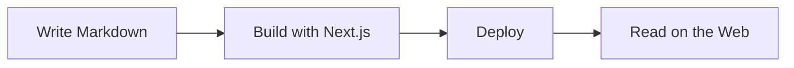

## Text Formatting

You can write **bold text**, *italic text*, and ~~strikethrough~~. You can also use `inline code` for short snippets.

## Links

Here is a [link to Next.js](https://nextjs.org) documentation.

## Blockquotes

> Design is not just what it looks like and feels like. Design is how it works.
>
> — Steve Jobs

## Code Blocks

Syntax highlighting is powered by Shiki with dual themes for light and dark mode.

### JavaScript

```js
function fibonacci(n) {
  if (n <= 1) return n;
  return fibonacci(n - 1) + fibonacci(n - 2);
}

console.log(fibonacci(10)); // 55
```

### TypeScript

```typescript
interface Article {
  title: string;
  date: string;
  tags: string[];
  cover?: string;
}

function getLatest(articles: Article[], count: number): Article[] {
  return articles
    .sort((a, b) => b.date.localeCompare(a.date))
    .slice(0, count);
}
```

### CSS

```css
:root {
  --background: #fafafa;
  --foreground: #171717;
  --accent: #3b82f6;
}

.dark {
  --background: #0a0a0a;
  --foreground: #ededed;
}
```

## Tables

| Feature | Status | Notes |
|---------|--------|-------|
| Markdown | Supported | GFM syntax |
| Syntax Highlighting | Supported | Shiki dual themes |
| Mermaid Diagrams | Supported | CDN loaded |
| Dark Mode | Supported | next-themes |
| Font Size Control | Supported | A-/A+ buttons |

## Lists

### Unordered

- Static site generation
- Markdown-based content
- Fully responsive design
- SEO optimized

### Ordered

1. Fork the repository
2. Install dependencies
3. Customize configuration
4. Write your articles
5. Deploy

### Task List

- [x] Set up project
- [x] Write first article
- [ ] Add more content
- [ ] Deploy to production

## Horizontal Rule

---

## Images

Images in markdown are rendered with rounded corners automatically.

## Mermaid Diagrams

You can include flowcharts and diagrams using mermaid syntax:



See the [Mermaid Diagrams](/articles/mermaid-diagrams) article for more examples.
