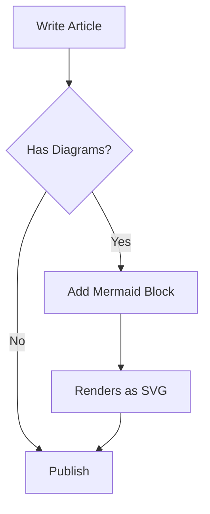
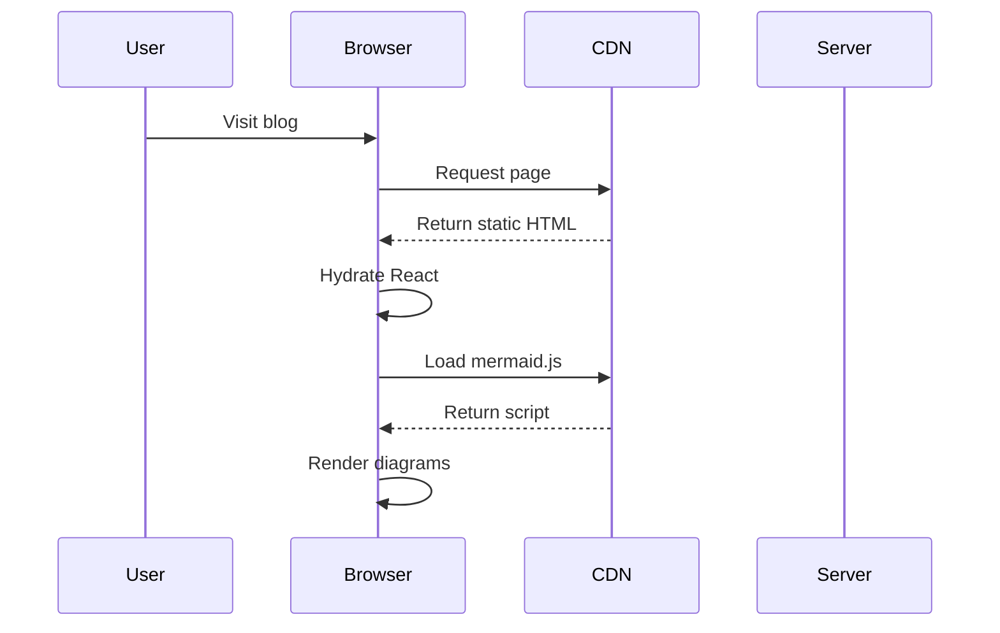

## What is Mermaid?

[Mermaid](https://mermaid.js.org) lets you create diagrams using text-based syntax. Write the diagram definition in a `mermaid` code block, and it renders as an interactive SVG.

## Flowchart

## Sequence Diagram

## How It Works

The rendering happens in two stages:

1. **Build time**: The markdown pipeline converts mermaid code blocks into `<pre class="mermaid">` elements
2. **Client side**: The mermaid.js library (loaded from CDN) finds these elements and renders them as SVGs

This approach keeps the build fast (no Playwright/Chromium needed) while still producing beautiful, interactive diagrams.

> **Tip:** Click on any diagram to open it in a zoomable lightbox. You can scroll to zoom and drag to pan.

## Syntax Reference

| Diagram Type | Keyword |
|-------------|---------|
| Flowchart | `graph TD` or `graph LR` |
| Sequence | `sequenceDiagram` |
| Class | `classDiagram` |
| State | `stateDiagram-v2` |
| Gantt | `gantt` |
| Pie Chart | `pie` |
| Git Graph | `gitGraph` |

## Dark Mode

Mermaid diagrams automatically adapt to your theme. When you switch between light and dark mode, the diagrams re-render with the appropriate color scheme.
